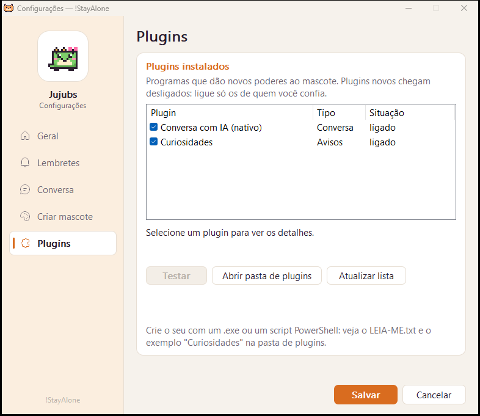

# 🐾 !StayAlone

> **English** · [Português](README.pt-BR.md)

A pixel-art pet that keeps you company on your Windows desktop. It walks along the
taskbar, naps when you step away, reminds you to drink water and stretch, and you
can chat with it through an AI plugin. Built to be **as light as possible**, straight
on the Win32 API, with no UI framework.

> The app's interface is in Brazilian Portuguese. So are the code comments.

<p align="center">
  
</p>

| | Target | Measured |
|---|---|---|
| Executable | < 5 MB | ~630 KB (+ optional chat plugin, ~310 KB) |
| Private memory | < 20 MB | ~2–4 MB |
| CPU | ~0% | ~0.03% of the machine |

## Download

Grab **[`StayAlone-v1.0.0-windows-x64.zip`](https://github.com/4TyllaL/notStayAlone/releases/latest)**
from the latest release, extract it anywhere and open `StayAlone.exe` (Windows 10/11, 64-bit).
Keep `stayalone-chat.exe` in the same folder if you want the AI chat. No installer, nothing
written outside `%APPDATA%\StayAlone`.

The binaries are not code-signed yet, so Windows SmartScreen may warn on first run
(*More info → Run anyway*). Each release ships a `SHA256SUMS.txt` so you can check the files.

## Features

- **Four mascots:** Calcifer (cat), Lance (dog), Zezé (bunny) and Jujubs (dinosaur),
  each with their own lines. Lines switch to the feminine form for "she" mascots.
- **Companionship:** notices when you leave and come back, gentle reminders counted only
  while you actually use the PC (water, stretch, rest your eyes, plus your own), affection
  hearts, a daily summary and an optional focus timer (pomodoro).
- **Play:** drag and throw it around, give it a treat, play ball. Reacts to low battery
  and to long typing streaks. Hides itself during full-screen games, videos and presentations.
- **Mascot maker:** draw one 16×16 pose and the app generates every animation (blink,
  sleep, walk, fall, happy) — or describe the mascot and let the AI draw it.
- **Chat:** any OpenAI-compatible API (Gemini by default, OpenAI, OpenRouter, local Ollama).
- **Plugins:** your own `.exe` or PowerShell scripts that make the mascot say things on a
  schedule, or that answer the chat. Toggled in the settings, verified by SHA-256.
- **Mods:** mascots are plain-text files, so you can make and share your own.

## Screenshots

<p align="center">
  
  
</p>
<p align="center">
  
  
</p>

## How it stays light

- Native layered windows (`UpdateLayeredWindow`); no WebView, no UI framework.
- Redraws only when the frame changes; every timer runs only when needed (60 fps only while
  something is falling, 10 fps normally, ~1.4 fps asleep, nothing while hidden).
- The panel, settings, speech bubble and toys exist only while on screen.
- No global keyboard/mouse hooks: it only knows *when* there was input
  (`GetLastInputInfo`), never *what*.
- The main app has no network code. Only the chat plugin talks to the internet, and only
  when you chat.

## Security

Reviewed in the style of a Common Criteria Security Target — threats, assumptions and how
each is handled are in [`SECURITY.md`](SECURITY.md) (in Portuguese). Highlights:

- The API key is stored in the **Windows Credential Manager** (DPAPI), never in a file or
  environment variable; it only travels over **HTTPS** (TLS 1.2+), redirects disabled.
- No pointers in window messages: data between windows goes through an in-process mailbox,
  so forged messages from other programs are ignored.
- Every input is bounded (mod files, AI replies, JSON depth, plugin output and run time).
- New plugins start **off**; enabling one asks for confirmation and pins its SHA-256.
- `winhttp.dll` and `dwmapi.dll` are loaded from System32 only; binaries have ASLR and DEP
  and run as the regular user (`asInvoker`).

## Build

Requires Rust (`stable-x86_64-pc-windows-gnu` or MSVC toolchain).

```bash
cargo build --release --workspace
```

This produces `target/release/StayAlone.exe` — a single file with the four mascots, the icon
and the manifest embedded — and the chat plugin `stayalone-chat.exe`, which must sit next
to it. The icon is drawn from the Calcifer sprite at build time (`build.rs`), no external
tools needed.

```bash
cargo test --workspace
```

## Usage

- **Click** the mascot to pet it; **drag** to carry and throw it.
- **Right-click** it (or click the tray icon) to open the panel: treat, ball, chat, focus
  timer, switch mascot, size, silence, settings.
- Command line (handy for Windows shortcuts; works while the app is running):
  `StayAlone.exe --bolinha` (ball), `--petisco` (treat), `--conversar` (chat),
  `--resumo` (daily summary), `--esconder` (hide/show), `--configurar` (settings).

Settings, mods and plugins live in `%APPDATA%\StayAlone\`. Mod and plugin formats are
documented in [`README.pt-BR.md`](README.pt-BR.md) and in the `LEIA-ME.txt` files the app
creates in those folders.

## Project layout

```
src/            the app (Win32 + pure logic modules with tests)
src/settings/   settings window and pixel editor
plugins/chat/   OpenAI-compatible chat plugin (WinHTTP, minimal JSON)
assets/         mascots, props, lines and the example plugin
build.rs        icon, manifest and version resources
docs/           screenshots
```

## License

[MIT](LICENSE)
