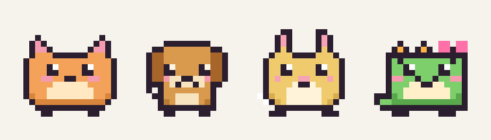
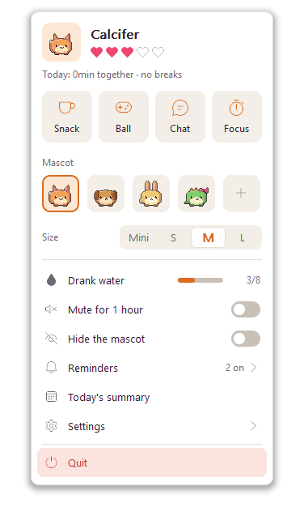
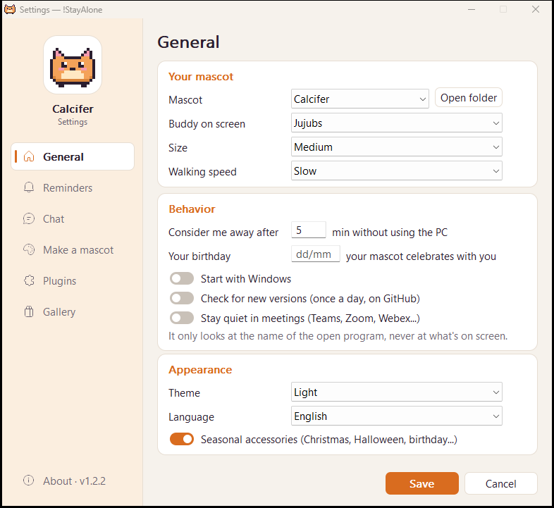
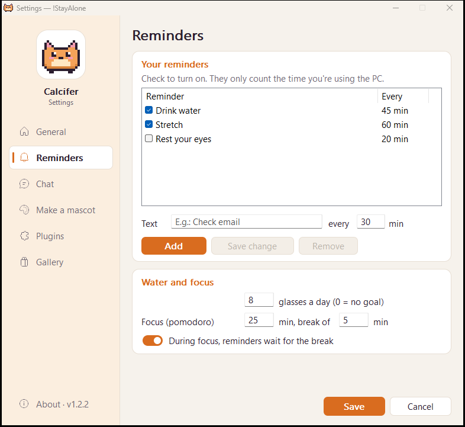
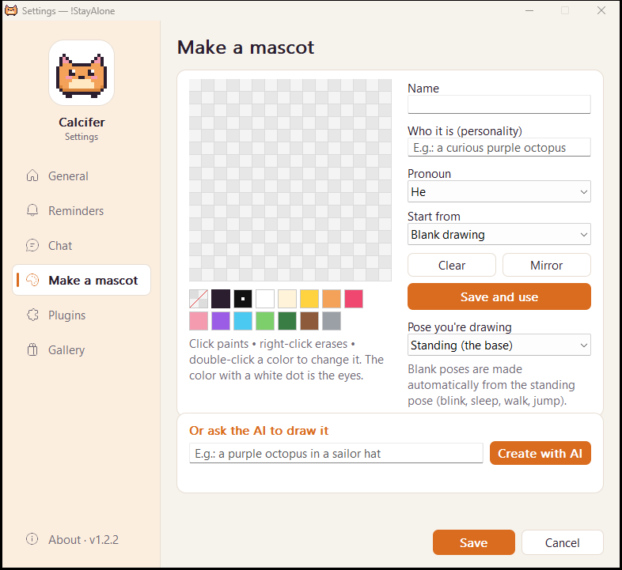
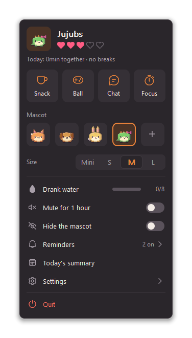
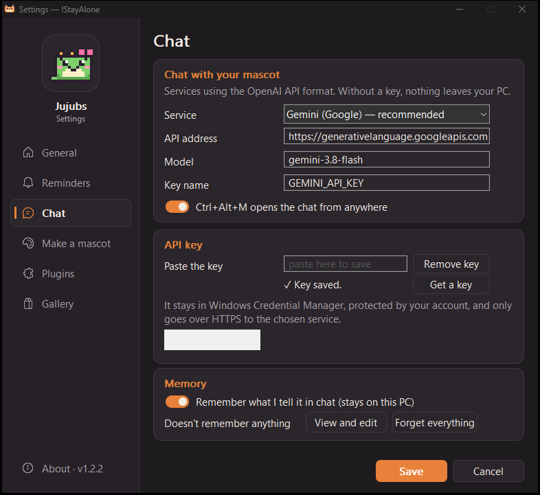

# 🐾 !StayAlone

> **English** · [Português](README.pt-BR.md)

A pixel-art pet that keeps you company on your Windows desktop. It walks along the
taskbar, naps when you step away, reminds you to drink water and stretch, and you
can chat with it through an AI plugin. Built to be **as light as possible**, straight
on the Win32 API, with no UI framework.

> The interface is available in **English** and **Brazilian Portuguese** (it follows Windows,
> or pick one in Settings). The code comments are in Portuguese.

<p align="center">
  
</p>

| | Target | Measured |
|---|---|---|
| Executable | < 5 MB | ~815 KB — a single `.exe`, AI chat included |
| Private memory | < 20 MB | ~2–4 MB |
| CPU | ~0% | ~0.03% of the machine |

## Download

Grab **[`dontStayAlone.exe`](https://github.com/4TyllaL/notStayAlone/releases/latest)** from the
latest release and run it (Windows 10/11, 64-bit). That single file is the whole app, AI chat
included. No installer, nothing written outside `%APPDATA%\StayAlone`.

> Why *dont*StayAlone? The app is **!StayAlone**, but GitHub strips the `!` from file names.

The binary is not code-signed yet, so Windows SmartScreen may warn on first run
(*More info → Run anyway*). GitHub shows the file's SHA-256 next to the download.

After that, the app **updates itself**: once a day it checks the latest GitHub release, and the
panel offers the new version. The download is verified against the release's SHA-256 and an
Ed25519 signature made with a key that never leaves the maintainer's PC before it
replaces the `.exe`; then it shows what was checked and what changed, and only installs if you
say yes (you can turn update checks off in Settings).

## Features

- **Four mascots:** Calcifer (cat), Lance (dog), Zezé (bunny) and Jujubs (dinosaur),
  each with their own lines. Lines switch to the feminine form for "she" mascots.
- **A buddy on screen:** pick a second mascot that walks around, visits the first one,
  naps next to it, shares the treat and chases the ball too.
- **Companionship:** notices when you leave and come back, gentle reminders counted only
  while you actually use the PC (water, stretch, rest your eyes, plus your own), affection
  hearts, a daily summary and a focus timer (pomodoro) with your own durations — reminders
  can wait for the break.
- **Water goal:** log each glass from the panel (or `--agua`) and watch the progress bar;
  the mascot celebrates the goal and your streak of days, and on Monday mornings it sums up
  the last week.
- **Guided breaks:** click the eyes or stretch reminder and the mascot walks you through
  it, step by step, with a countdown.
- **Routine and mood:** birthday wishes, Monday and Friday lines, a nudge after three hours
  without a break, and it stays **quiet during meetings** (Teams, Zoom, Webex... — it only
  checks the name of the program in front, never the screen).
- **Play:** drag and throw it around, give it a treat, play ball. Reacts to low battery
  and to long typing streaks. Hides itself during full-screen games, videos and presentations.
- **Mascot maker:** draw one pose and the app generates every animation (blink, sleep,
  walk, fall, happy). Optionally draw your own sleeping, eating, happy and walking poses
  (with onion skin). Mascots can be 16×16 or 32×32 — or describe one and let the AI draw it.
- **Chat:** any OpenAI-compatible API (Gemini by default, OpenAI, OpenRouter, local Ollama).
- **Memory:** it can remember what you tell it in chat (an exam on Friday, your cat's name)
  and bring it up later. Kept only in a text file on your PC that you can view, edit or
  wipe; passwords, documents and numbers are never stored.
- **Community mascots:** install mascots shared in this repository, right from Settings.
  Only mascots — drawings and lines in plain text, nothing that runs on your PC — and every
  file is checked against its SHA-256 before it's written.
- **Dark mode:** follows Windows, or choose light/dark in Settings.
- **Seasonal hats:** a Santa hat at Christmas, a witch hat at Halloween, a straw hat in
  June and a party hat on your birthday and New Year's.
- **Ctrl+Alt+M** opens the chat from anywhere (only that key combination is registered;
  the app never reads the keyboard).
- **Plugins:** your own `.exe` or PowerShell scripts that make the mascot say things on a
  schedule, or that answer the chat. Toggled in the settings, verified by SHA-256.
- **Mods:** mascots are plain-text files, so you can make and share your own.

## Screenshots

<p align="center">
  
  
</p>
<p align="center">
  
  
</p>
<p align="center">
  
  
</p>
<p align="center">
  
</p>

## How it stays light

- Native layered windows (`UpdateLayeredWindow`); no WebView, no UI framework.
- Redraws only when the frame changes; every timer runs only when needed (60 fps only while
  something is falling, 10 fps normally, ~1.4 fps asleep, nothing while hidden).
- The panel, settings, speech bubble and toys exist only while on screen.
- No global keyboard/mouse hooks: it only knows *when* there was input
  (`GetLastInputInfo`), never *what*.
- The mascot process never touches the network. When you chat, check for updates or open
  the gallery, the app starts a second, short-lived copy of itself (`--ia`,
  `--procurar-versao`, `--galeria`...) that makes the request and exits.

## Security

Reviewed in the style of a Common Criteria Security Target — threats, assumptions and how
each is handled are in [`SECURITY.md`](SECURITY.md) (in Portuguese). Highlights:

- The API key is stored in the **Windows Credential Manager** (DPAPI), never in a file or
  environment variable; it only travels over **HTTPS** (TLS 1.2+), redirects disabled.
- No pointers in window messages: data between windows goes through an in-process mailbox,
  so forged messages from other programs are ignored.
- Every input is bounded (mod files, AI replies, JSON depth, plugin output and run time).
- New plugins start **off**; enabling one asks for confirmation (showing the file's
  SHA-256 and whether it wants internet access) and pins that SHA-256. Every plugin runs in
  its own **AppContainer sandbox**: it only reads its own folder, writes only to a data
  folder of its own, can't reach your files, gets a minimal environment and has no network
  unless its `plugin.ini` asks for `internet = sim` and you approve. A plugin can also ask
  for specific folders of yours (`ler = Documentos\Notas`, `gravar = Downloads`); you see
  each one when approving, broad or sensitive folders (your whole profile, AppData, `.ssh`,
  Windows...) are refused, and turning the plugin off takes the access back. Every plugin and helper
  process also runs in a Windows Job Object: it can't start other programs, use the
  clipboard, touch other windows or system settings, is capped at 512 MB and dies with the app.
- Updates only come from this repository's releases, are checked against the SHA-256
  GitHub publishes **and** an Ed25519 signature (key kept offline, not on GitHub, so a
  compromised repository can't push an update), and never go back to an older version. Gallery files are checked
  against the SHA-256 in `gallery/index.json`.
- `winhttp.dll`, `dwmapi.dll` and `uxtheme.dll` are loaded from System32 only; binaries have
  ASLR and DEP and run as the regular user (`asInvoker`). The MSVC build adds Control Flow
  Guard and CET shadow stack compatibility.

## Build

Requires Rust (`stable-x86_64-pc-windows-gnu` or MSVC toolchain). With MSVC,
`.cargo/config.toml` turns on Control Flow Guard and a static CRT. Releases are built with
`tools/release.ps1`: a pinned MSVC toolchain (Rust 1.98.1), a clean git tree, a check that
DEP, ASLR, high-entropy ASLR and CFG are all set, the Ed25519 update signature, and a
`BUILDINFO.txt` published next to the `.exe` with the exact commit, Rust/Cargo/MSVC/Windows SDK
versions, flags and hashes. The build is reproducible bit for bit (no timestamps, dates or
local paths in the `.exe`): the same commit with the same toolchain, MSVC and SDK gives the same
SHA-256. Releases up to 1.2.4 were built with the GNU toolchain and have no CFG.

```bash
cargo build --release
```

This produces `target/release/dontStayAlone.exe` — a single file with the four mascots, the
AI chat, the icon and the manifest embedded. The icon is drawn from the Calcifer sprite at
build time (`build.rs`), no external tools needed.

```bash
cargo test
```

`tools/smoke.ps1` is a UI smoke test: it opens the real app with an isolated data folder,
goes through the welcome, the panel, the settings (Portuguese and English), a guided break
and the chat shortcut, and checks what was saved. It refuses to run while the app is open
and only screenshots the app's own windows; `-Docs` refreshes the images in `docs/`.

## Usage

- **Click** the mascot to pet it; **drag** to carry and throw it.
- **Right-click** it (or click the tray icon) to open the panel: treat, ball, chat, focus
  timer, switch mascot, size, water, silence, settings.
- **Ctrl+Alt+M** opens the chat (can be turned off in Settings → Chat).
- **Settings → About** (at the bottom of the sidebar) shows the version, the release date and
  links to the author's projects page and to this repository. Its **Security and privacy**
  card shows, in plain words, what protects you: the SHA-256 of the running `.exe` (compare it
  with GitHub's), how updates are checked, where the API key lives, which services the app
  talks to, whether it starts with Windows and how many plugins are on (sandboxed, and
  how many with internet).
- Command line (handy for Windows shortcuts; works while the app is running):
  `dontStayAlone.exe --bolinha` (ball), `--petisco` (treat), `--conversar` (chat),
  `--agua` (I drank water), `--resumo` (daily summary), `--esconder` (hide/show),
  `--configurar` (settings).

Settings, mods and plugins live in `%APPDATA%\StayAlone\`. Mod and plugin formats are
documented in [`README.pt-BR.md`](README.pt-BR.md) and in the `LEIA-ME.txt` files the app
creates in those folders.

## Project layout

```
src/            the app (Win32 + pure logic modules with tests)
src/settings/   settings window and pixel editor
src/ai/         AI chat (OpenAI-compatible API over WinHTTP, minimal JSON), run as --ia
assets/         mascots, props, lines (Portuguese and *_en.txt) and the example plugin
gallery/        community mascots (index.json made by tools/gallery.py)
build.rs        icon, manifest and version resources
docs/           screenshots
```

## License

[MIT](LICENSE)
